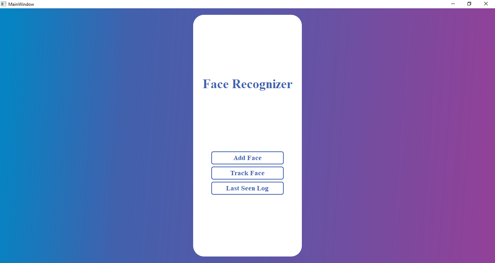
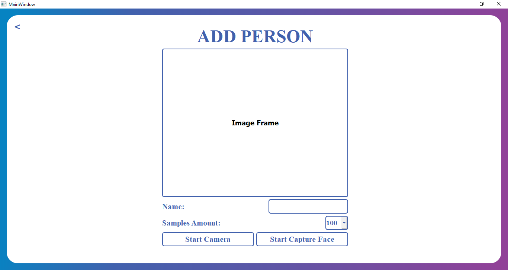
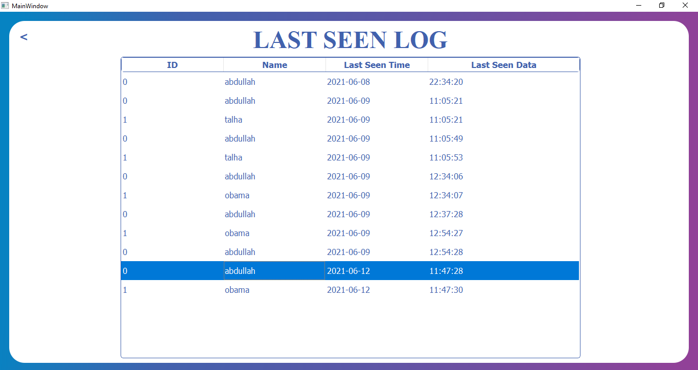
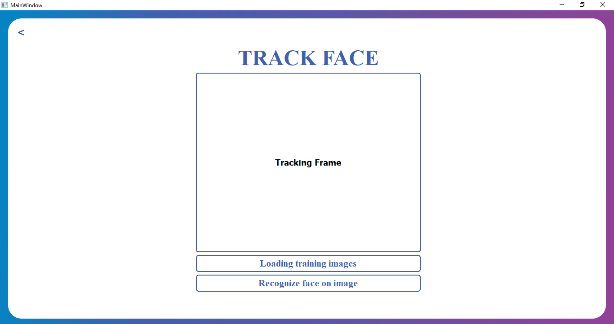

# Face Recognition using face embeddings

### Clone the repository from 
https://github.com/abdullah0307/Face-Recognition-using-Face-Embeddings

### Download the keras face net model from the link and place into the root directory
https://drive.google.com/drive/folders/1pwQ3H4aJ8a6yyJHZkTwtjcL4wYWQb7bn

## Screen Shots
####Home screen

####Add new person face 

#### Also the see the last tracked person in the list

#### Track the the person face over a video

### Clone the repository from 
https://github.com/abdullah0307/Face-Recognition-using-Face-Embeddings

### Requirement of python interpreter
* Python 3.6

### Installing Required Packages
`pip install -r requirments.txt`

### Run the script
`python main.py`
